# Provisioning
Disini saya membuat 2 vm dari biznet dengan nama dan kebutuhannya 
- appserver 
- gateway

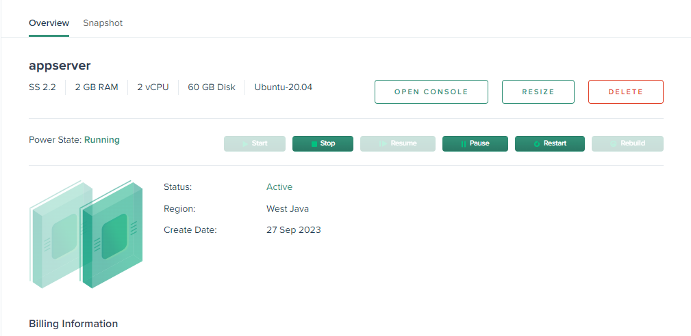

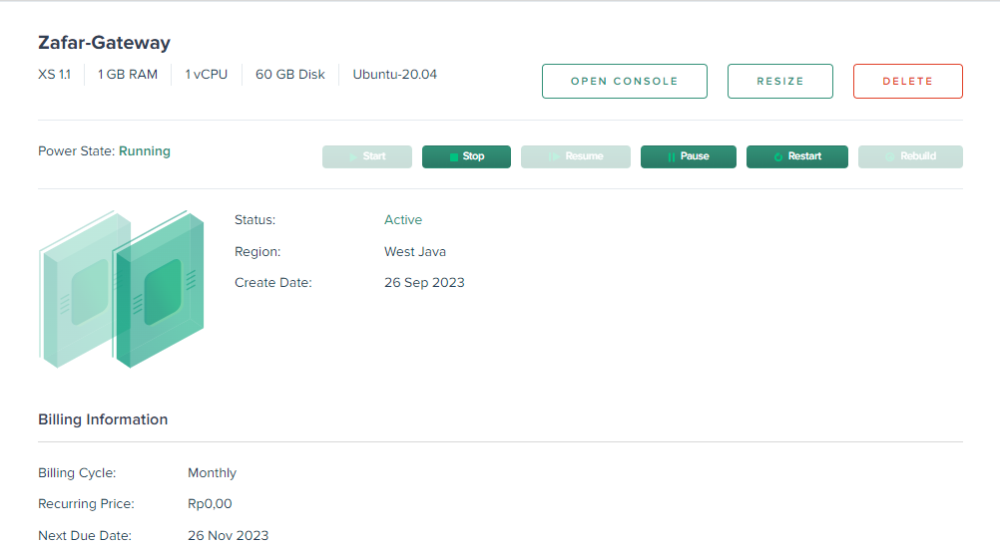

***
# Server Configuration using Ansible
Disini saya membuat 3 volder yaitu 
- alll server 
- appserver
- gateway

setelah membuat folder selanjutnya, disini saya membuat folder khusus ansible dengan perintah `mkdir ansible` nantinya semua proses akan berjalan disini yang akan menggunakan ansible, setelah itu masuk `cd ansible`, lalu buat lah file nano `ansible.cfg`

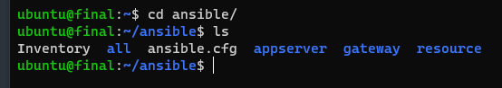

```
[defaults]
inventory = Hosts
private_key_file = ~/.ssh/id_rsa
host_key_checking = false
interpreter_python = auto_silent
```

Setelah sudah mengarahkan ke Hosts sekarang kita akan buat file `nano Hosts` yang berisikan semua data ip kita dari vm yang ada di idch

```
[appserver]
103.175.216.224

[gateway]
103.127.97.56

[appserver:vars]
ansible_user="appser"
ansible_pythone_interpreter=/usr/bin/python3

[gateway:vars]
ansible_user="Gateway"
```

Selanjutnya saya membuat file di appserver yaitu `install-docker.yml`dengan isi seperti ini

```
- hosts: all # masukan hosts yang kalian ingin tuju (disini saya memasukan ke semua hosts)
  become: true
  vars:
    container_count: 4
    default_container_name: docker
    default_container_image: ubuntu
    default_container_command: sleep 1d

  tasks:
    - name: Install aptitude
      apt:
        name: aptitude
        state: latest
        update_cache: yes

    - name: Correct Problem
      command: sudo dpkg --configure -a

    - name: Install required system packages
      apt:
        pkg:
          - apt-transport-https
          - ca-certificates
          - curl
          - software-properties-common
          - python3-pip
          - virtualenv
          - python3-setuptools
        state: latest
        update_cache: yes

    - name: Add Docker GPG apt Key
      apt_key:
        url: https://download.docker.com/linux/ubuntu/gpg
        state: present

    - name: Add Docker Repository
      apt_repository:
        repo: deb https://download.docker.com/linux/ubuntu focal stable
        state: present

    - name: Update apt and install docker-ce
      apt:
        name: docker-ce
        state: latest
        update_cache: yes

    - name: Install Docker Module for Python
      pip:
        name: docker

    - name: add user docker group
      user:
        name: appser
        groups: docker
        append: yes

    - name: add user docker group
      user:
        name: Gateway
        groups: docker
        append: yes
```

dengan ini nantinya akan menambahkan 2 user sekaligus tanpa harus kita masuk ke vm lalu add user lagi

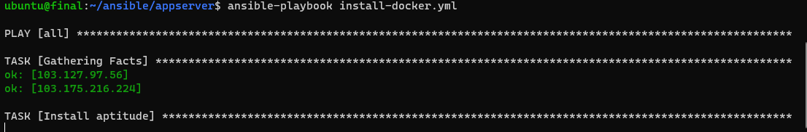

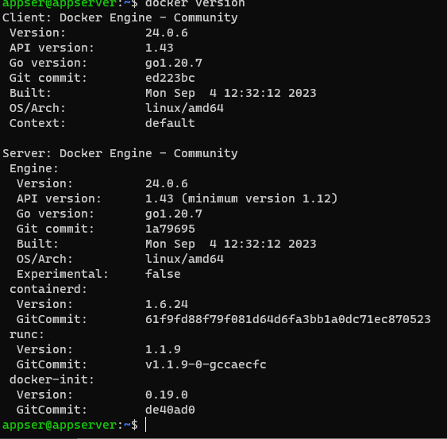

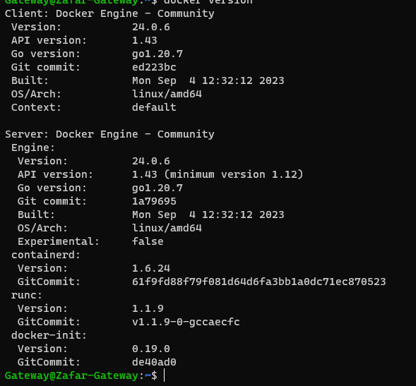
>Note : setelah instalasi berhasil di ansible kalian harus memastikan nya apakah suda terinstall semua apa blm jika sudah mari kita lanjut ke step selanjutnya

disini saya menyiapkan install node exporter yaitu 
```
- name: Deploy Node Exporter with Docker
  hosts: all
  become: true
  tasks:
    - name: Pull the bitnami/node-exporter Docker image
      docker_image:
        name: bitnami/node-exporter
        source: pull

    - name: Run the Node Exporter container
      docker_container:
        name: node-exp
        image: bitnami/node-exporter
        state: started
        restart_policy: unless-stopped
        published_ports:
          - "9100:9100"
```
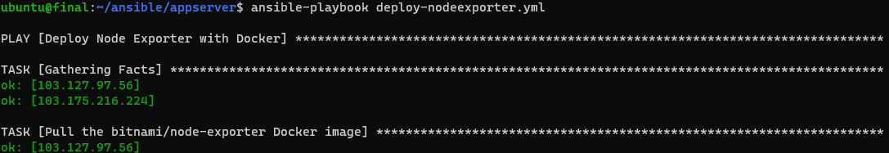
>jika sudah cek terlebih dahulu dengan masuk ke vm dengan perintah docker ps atau docker ps -a

selanjutnya saya mengeclone github nya yaitu dengan perintah 
```
- name: Clone fe-dumbmerch and be-dumbmerch Repositories and Add Remotes
  hosts: appserver

  tasks:
    - name: Clone fe-dumbmerch repository
      git:
        repo: https://github.com/demo-dumbways/fe-dumbmerch.git
        dest: /home/appser/fe-dumbmerch

    - name: Add remote "upstream" for fe-dumbmerch
      command: git remote add upstream https://github.com/demo-dumbways/fe-dumbmerch.git
      args:
        chdir: /home/appser/fe-dumbmerch

    - name: Clone be-dumbmerch repository
      git:
        repo: https://github.com/demo-dumbways/be-dumbmerch.git
        dest: /home/appser/be-dumbmerch

    - name: Add remote "upstream" for be-dumbmerch
      command: git remote add upstream https://github.com/demo-dumbways/be-dumbmerch.git
      args:
        chdir: /home/appser/be-dumbmerch

    - name: Copy file Dockerfile (backend)
      copy:
        src: ~/ansible/appserver/Dockerfile
        dest: /home/appser/be-dumbmerch/Dockerfile
        owner: appser

    - name: Copy file Dockerfile (Frontend)
      copy:
        src: ~/ansible/resource/Dockerfile
        dest: /home/appser/fe-dumbmerch
        owner: appser
        group: appser
        group: appser

    - name: Copy file docker-compose
      copy:
        src: ~/ansible/resource/docker-compose.yml
        dest: /home/appser/docker-compose.yml
        owner: appser
        group: appser
```

```
version: "3.3"  
services:
   db:
    image: postgres:latest
    container_name: db-dumbmerch
    ports:
      - 5432:5432
    volumes:
      - ~/postgresql:/var/lib/postgresql/data
    environment:
      - POSTGRES_USER=zafar
      - POSTGRES_PASSWORD=zafar2501
      - POSTGRES_DB=dumbways
   backend:
    depends_on:
      - db
    build:
      context: ./be-dumbmerch
      dockerfile: Dockerfile
    container_name: be-dumbmerch
    stdin_open: true
    restart: unless-stopped
    ports:
      - 5000:5000
   frontend:
    build:
      context: ./fe-dumbmerch
      dockerfile: Dockerfile
    container_name: fe-dumbmerch
    stdin_open: true
    restart: unless-stopped
    ports:
      - 3000:3000
```

### Dockerfile (Frontend)
```
FROM node:16-alpine AS staging
WORKDIR /usr/src/app
COPY . .
RUN yarn install
RUN yarn build

FROM node:16-alpine AS production
WORKDIR /home/root
COPY --from=staging /usr/src/app/build /home/root/build
RUN yarn global add serve
EXPOSE 3000
CMD ["npx", "serve", "-s", "build", "-l", "3000"]
```

### Dockerfile (Backend)
```
FROM golang:1.16.7-alpine AS staging
WORKDIR /usr/src/app
COPY . .

FROM golang:1.16.7-alpine AS production
WORKDIR /home/root
COPY --from=staging /usr/src/app /home/root
EXPOSE 5000
CMD ["go", "run", "main.go"]
```
>Node : pastikan udah ada di appserver nya dengan nama fe-dumbmerch dan be-dumbmerch

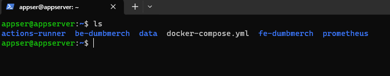


selanjutnya saya mendeploy monitoring memakai grafana dan prometheus 

```
- name: Deploy Monitoring
  hosts: appserver
  become: true
  tasks:
    - name: Create directory for Prometheus config
      file:
        path: /home/appser/prometheus
        state: directory
        mode: '0755'

    - name: Copy prometheus.yml configuration file
      copy:
        src: /home/ubuntu/ansible/resource/prometheus.yml
        dest: /home/appser/prometheus/prometheus.yml
        mode: "0644"

    - name: Pull bitnami/prometheus Docker image
      docker_image:
        name: bitnami/prometheus
        source: pull

    - name: Run Prometheus container
      docker_container:
        name: prometheus
        image: bitnami/prometheus
        state: started
        ports:
          - "9090:9090"
        volumes:
          - /home/appser/prometheus:/etc/prometheus

    - name: Pull Grafana Docker image
      docker_image:
        name: grafana/grafana
        source: pull

    - name: Run Grafana container
      docker_container:
        name: grafana
        image: grafana/grafana
        state: started
        ports:
          - "2407:3000"
```

### Prometheus.yml
```
scrape_configs:
- job_name: Final-Assidiq
  scrape_interval: 5s
  static_configs:
  - targets:
    - nodeep.zafar.studentdumbways.my.id
    - nodeget.zafar.studentdumbways.my.id
```

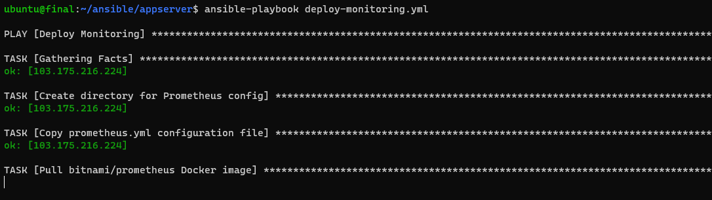

***


# Gateway 
Di gateway saya membuat 3 konfigurasi yang pertama saya atur dimana agar menjalankan nginx di server lalu saya membuat ssl certification mmenggunakan certbot dan terakhir akan saya bahas di web server wildcard

```
- name: install nginx
  hosts: gateway
  tasks:
    - name: ensure nginx is at the latest version
      apt:
        name: nginx
        state: latest
        update_cache: yes
      become: yes

    - name: start nginx
      service:
        name: nginx
        state: started
      become: yes

    - name: copy the nginx config rproxy
      copy:
        src: ~/ansible/resource/rproxy.conf
        dest: /etc/nginx/sites-enabled/rproxy.conf
      become: yes

    - name: restart nginx
      service:
        name: nginx
        state: restarted
      become: yes
```

ini untuk nginx dan dia akan mengcopy file rproxy di resource 

```
server {
    server_name prometheus.zafar.studentdumbways.my.id;

    location / {
        proxy_pass http://103.175.216.224:9090;
    }
}

server {
    server_name grafana.zafar.studentdumbways.my.id;

    location / {
        proxy_pass http://103.175.216.224:2407;
         proxy_set_header Host $host;
         proxy_set_header X-Real-IP $remote_addr;
         proxy_set_header X-Forwarded-For $proxy_add_x_forwarded_for;
         proxy_set_header X-Forwarded-Proto $scheme;
        }
}

server {
    server_name nodeep.zafar.studentdumbways.my.id;

    location / {
        proxy_pass http://103.175.216.224:9100;
    }
}

server {
    server_name zafar.studentdumbways.my.id;

    location / {
        proxy_pass http://103.175.216.224:3000;
    }
}

server {
    server_name api.zafar.studentdumbways.my.id;

    location / {
        proxy_pass http://103.175.216.224:5000;
    }
}

server {
    server_name nodeget.zafar.studentdumbways.my.id;

    location / {
        proxy_pass http://103.127.97.56:9100;
    }
}
```

Disini saya jalankan semua nya 
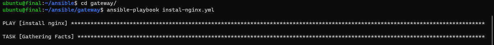
>Note: jika semua instal nginx.yml sudah dijalankan tinggal kita ssl dengan certbot berikut caranya dan sebelum mulai pastikan ke gateway sudah benar benar ada file rproxy nya 

disini saya membuat terlebih dahulu file certbot.yml seperti  ini

```
- name: Install Certbot and obtain SSL certificates
  hosts: gateway  # Ganti 'gateway' dengan nama host yang sesuai dalam inventory Anda
  tasks:
    - name: Install Certbot with Snap
      snap:
        name: certbot
        classic: yes
        state: present
      become: yes

    - name: Obtain and install SSL certificate with Certbot Nginx node gate
      command: certbot --nginx -d nodeget.zafar.studentdumbways.my.id --non-interactive --agree-tos --email zafar@gmail.com
      become: yes

    - name: Obtain and install SSL certificate with Certbot Nginx dumbmerch
      command: certbot --nginx -d zafar.studentdumbways.my.id --non-interactive --agree-tos --email zafar@gmail.com
      become: yes

    - name: Obtain and install SSL certificate with Certbot Nginx api dumbmerch
      command: certbot --nginx -d api.zafar.studentdumbways.my.id --non-interactive --agree-tos --email zafar@gmail.com
      become: yes

    - name: Obtain and install SSL certificate with Certbot Nginx prometheus
      command: certbot --nginx -d prometheus.zafar.studentdumbways.my.id --non-interactive --agree-tos --email zafar@gmail.com
      become: yes

    - name: Obtain and install SSL certificate with Certbot Nginx garafana
      command: certbot --nginx -d grafana.zafar.studentdumbways.my.id --non-interactive --agree-tos --email zafar@gmail.com
      become: yes

    - name: Obtain and install SSL certificate with Certbot Nginx node app
      command: certbot --nginx -d nodeep.zafar.studentdumbways.my.id --non-interactive --agree-tos --email zafar@gmail.com
      become: yes

    - name: Obtain and install SSL certificate with Certbot Nginx node getway
      command: certbot --nginx -d nodeget.zafar.studentdumbways.my.id --non-interactive --agree-tos --email zafar@gmail.com
      become: yes

    - name: restart nginx
      service:
        name: nginx
        state: restarted
      become: yes
```

dan jika sudah maka jalankan lagi sesuai nama filenya ansible-playbook certbot.yml dan kalian bisa cek 

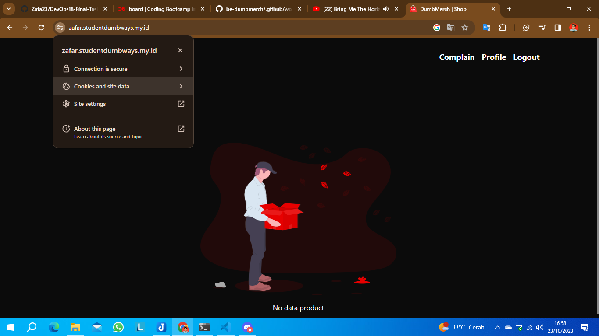

