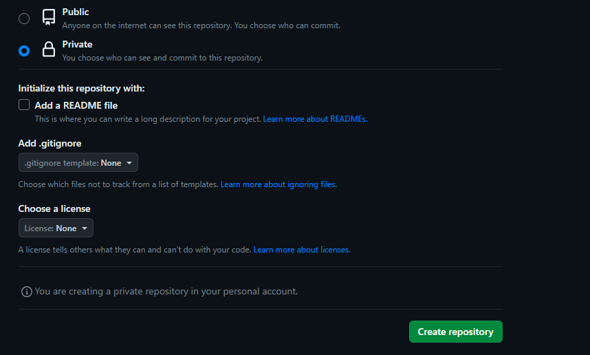

pertama saya copy terlebih dahulu lalu setelah itu tambahkan ssh key di github


lalu selanjutnya test connection ssh untuk memastikan bahwa sudah terhubung dengan perintah dibawah ini 
```
ssh -T git@github.com
```


lalu jalankan perintah clone, saya sudah membuat nya di ansible untuk contoh cloningan nya seperti ini
```
---
- name: Clone fe-dumbmerch and be-dumbmerch Repositories and Add Remotes
  hosts: appserver

  tasks:
    - name: Clone fe-dumbmerch repository
      git:
        repo: https://github.com/demo-dumbways/fe-dumbmerch.git
        dest: /home/zafar/fe-dumbmerch

    - name: Add remote "upstream" for fe-dumbmerch
      command: git remote add upstream https://github.com/demo-dumbways/fe-dumbmerch.git
      args:
        chdir: /home/zafar/fe-dumbmerch

    - name: Clone be-dumbmerch repository
      git:
        repo: https://github.com/demo-dumbways/be-dumbmerch.git
        dest: /home/zafar/be-dumbmerch

    - name: Add remote "upstream" for be-dumbmerch
      command: git remote add upstream https://github.com/demo-dumbways/be-dumbmerch.git
      args:
        chdir: /home/zafar/be-dumbmerch
```


# Create Private Repository


>Pertama buat file dulu untuk frontend dengan settingan seperti ini 


>Jika sudah dibuat masuk ke folder `fe-dumbmerch` lalu buatkan branch branch baru yang di butuhkan setelah selesai membuat nya kita akan push semua ke semua branch tersebut


>Note : lakukan yang sama ke backend, namun ada penambahan file baru untuk pelengkap dari backend dan frontend namun saya menaruh nya bukan di branch utama tapi di branch sblmnya yang sudah saya buat 


