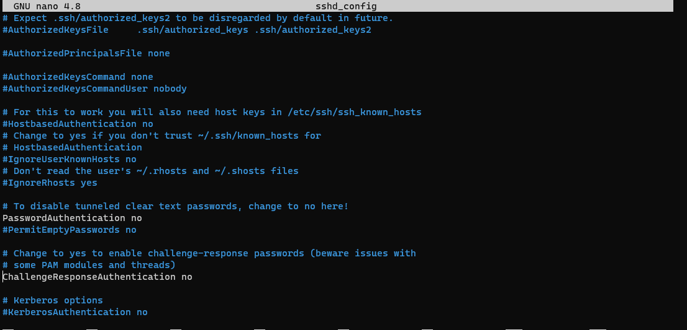
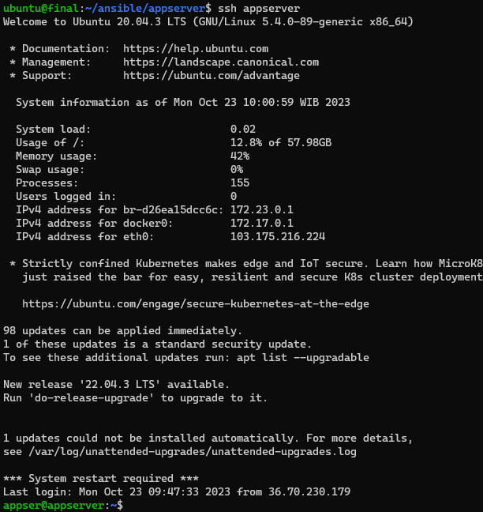
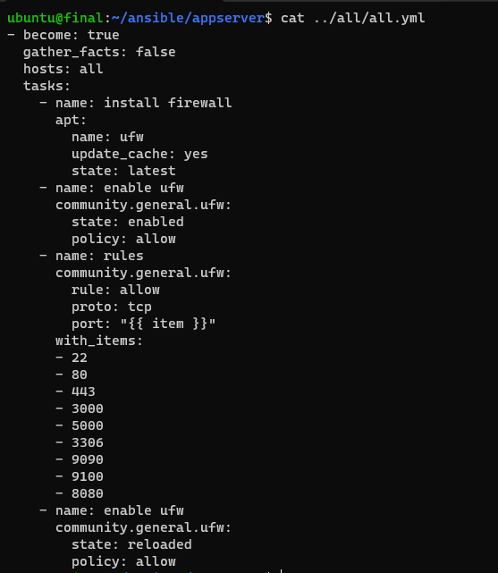

# Server management 
## Server only login with ssh & Password login disable
disini saya masuk ke masing masing vm dengan tujuna mengganti PasswordAuthentication yes menjadi PasswordAuthentication no, bertujuan agar ketika login hanya bisa dilakukan dengan ssh key saja 


> Note : setelah mensetting nya harap di restart mesin dari ssh nya

# Create Config

dan selanjut nya saya membuat sistem onegateway dengan cara ini saya cukup masuk dengan nama vm nya saja contoh `ssh appserver` dengan cara ini cukup simpel dan cepat tanpa harus menggunakan cara masukan username dan menghafal ip walaupun sudah di disable password, daan membuat file yang isinya seperti ini `nano .ssh/config`

```
host gateway
    HostName 103.189.234.170
    User zafar

host appserver
    Hostname 103.250.10.208
    User zafar
    ProxyCommand ssh gateway -W %h:%p
    IdentityFile /home/zafar/.ssh/privatekey

host monitor
    Hostname 103.250.10.214
    User zafar
    ProxyCommand ssh gateway -W %h:%p
    IdentityFile /home/zafar/.ssh/privatekey
```




# Firewall
saya membuat sebuah ansible scripting dengan ini saya menginstal dan mengkonfigurasi firewall UFW pada host "gateway" dengan beberapa aturan yang memperbolehkan koneksi ke port-port yang telah ditentukan.


