# Deployment 
Karna pada provisioning saya sudah mengeclone github fe-dumbmerch dan be-dumbmerch selanjutnya saya akan masuk ke masing masing file dan mengedit di file `nano .env`

Dan ini yang saya tambahkan di be-dumbmerch 
```
DB_HOST=103.175.216.224
DB_USER=zafar
DB_PASSWORD=katasandi
DB_NAME=dumbmerch
DB_PORT=5432
PORT=5000
```
>Note : pada .env backend harap samakan seperti di docker compose yaitu 

ini file docker compose nya samakan di bagian servis postgres agar terintergration 
```
version: '3.8'
services:
  frontend:
    build: ./fe-dumbmerch
    container_name: frontend-container
    ports:
      - "3000:3000"
    depends_on:
      - postgres
    networks:
      - network
    restart: unless-stopped

  backend:
    build: ./be-dumbmerch
    container_name: backend-container
    ports:
      - "5000:5000"
    depends_on:
      - postgres
    networks:
      - network
    restart: unless-stopped

  postgres:
    image: "postgres"
    container_name: database-container
    environment:
      POSTGRES_PASSWORD: katasandi
      POSTGRES_USER: zafar
      POSTGRES_DB: dumbmerch
    volumes:
      - "./data/postgresql:/var/lib/postgresql/data"
    networks:
      - network
    ports:
      - "5432:5432"
    restart: unless-stopped

networks:
  network:
```

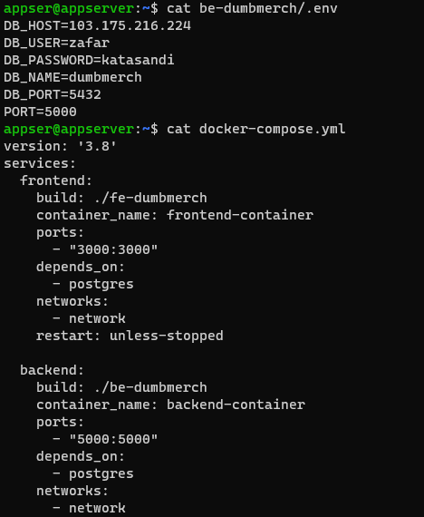

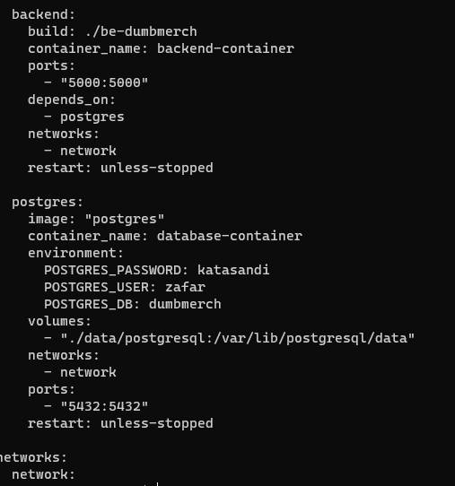

pada frontend memang belum ada untuk file .env makanya disini cukup dibuat saja dengan perintah `nano .env` jika tidak bisa maka gunakan `sudo`sebelum nano

```
REACT_APP_BASEURL=https://api.zafar.studentdumbways.my.id/api/v1
```

jika semua sudah terintergrasi dengan baik balik ke halaman home lalu jalankan `docker compose up -d`dan jika sudah jalankan `docker ps` atau `docker ps`

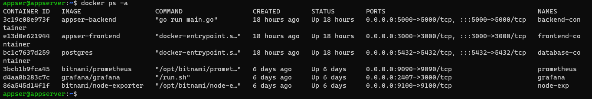
>Note : setiap menjalankan docker harap masuk ke user nya dulu yaitu disini user saya appser maka saya masuk sudo su appser baru jalankan command seblumnya agar berjalan dengan baik 

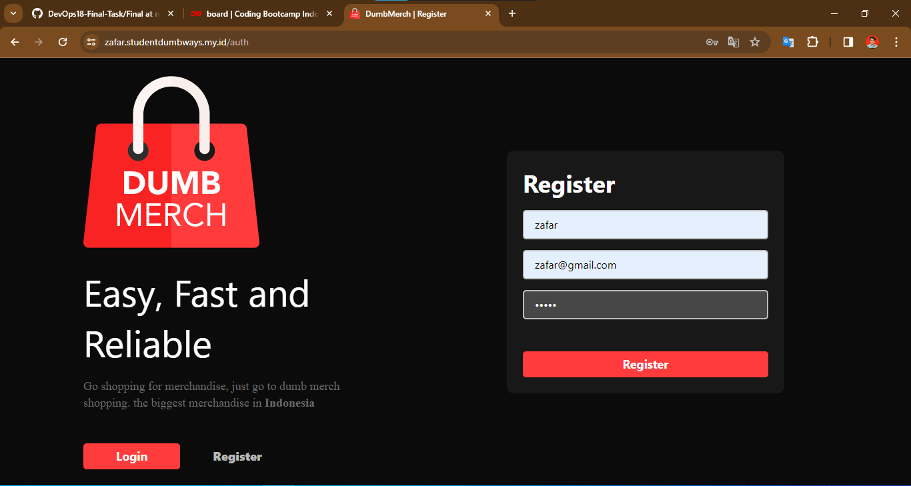

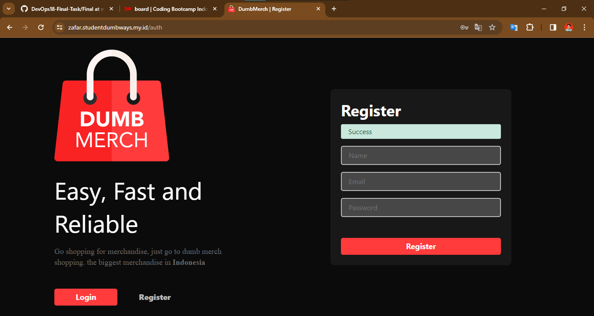

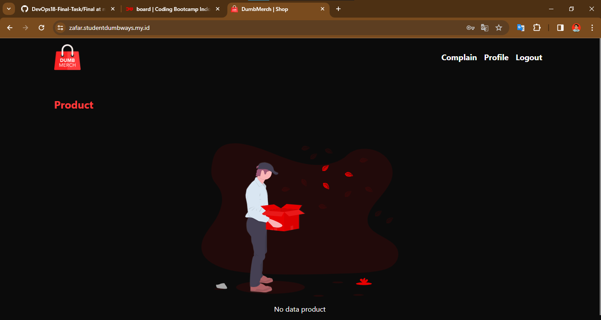

Dan ini tampilan jika semua sudah terintergrasi semua berjalan baik baik saja dimana semuanya sudah bisa bikin akun dan sudah bisa diakses, dan selanjutnya saya akan langsung ke ci/cd menggunakan github action
***

# Github Action

Pada bagian ini cukup kalian pergi ke repo yang tadi sudah di upload fe-dumbmerch dan be-dumbmerch dan lalu pergi ke bagian setting dulu 

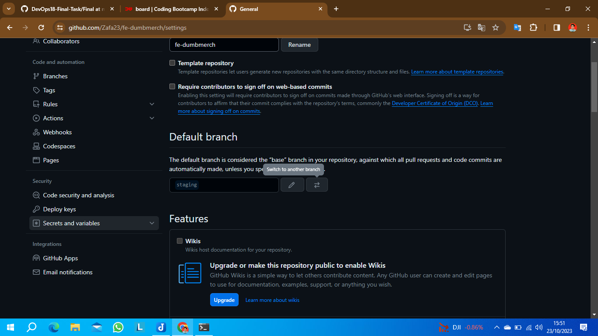

Dibagian ini kalian akan setting sshkey private,username docker hub dan token docker hub kalian pilih yang bagian `secrets and variable` lalu pilih `action` 
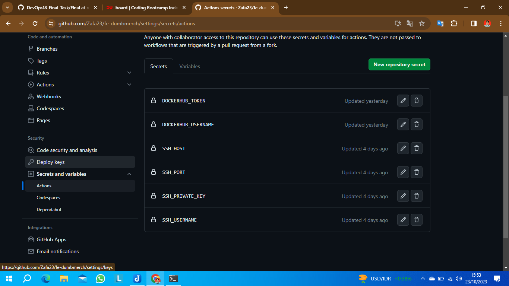 
lalu kalian tambahkan `new repository secrets` disini saya bikiin 6 yaitu 
- DOCKERHUB_TOKEN 
>Note : kalian bisa bikin di docker.hub di chrome kalian cari lalu pergi ke pojok kanan ada username kalian lalu kalian tinggal pilih account setting lalu pergi ke security lalu kalain tinggal pilih new acces token jika sudah tinggal sae alu masukan token nya di value secret nya

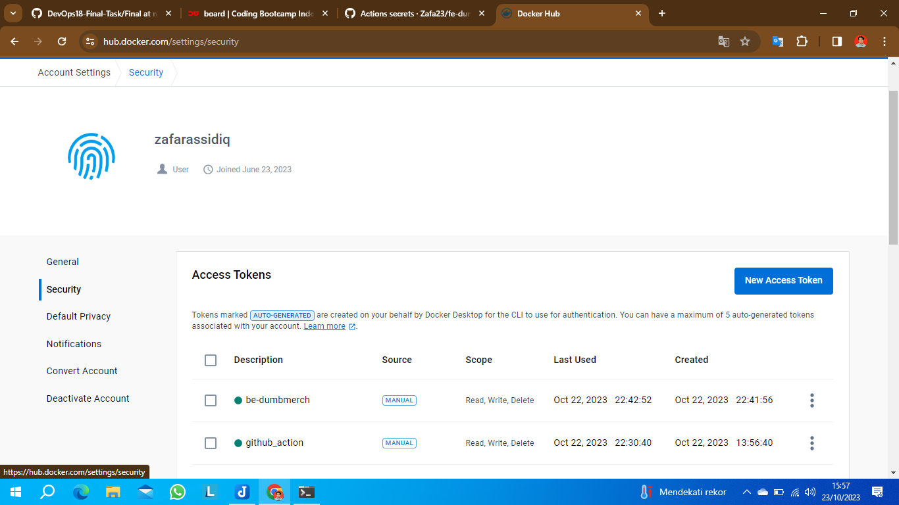


- DOCKERHUB_USERNAME
>Note kalian cukup masukan username docker hub kalian saja contoh `zafarassidiq`
- SSH_HOST
>Note: kalian cukup masukan host kalian
- SSH_PORT
> Note: kalian cukup masukan port yang biasa digunakan pada ssh 
- SSH_PRIVATE_KEY
> Note: di bagian ini kalian tambahkan dimana kalian harus ambil id_rsa di server kalian 
- SSH_USERNAME
>Noote: ini kalian cukup masukan username padaserver kalian apa 

selanjut nya jika sudah semua kalian tinggal masuk kebagian action
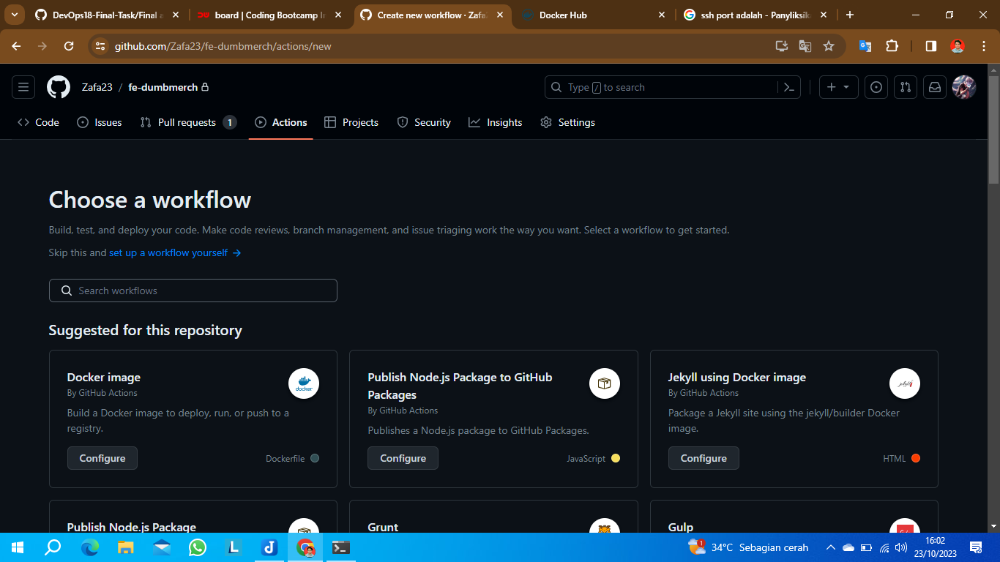

pada menu ini kalian tinggal pilih `set up a workflow yourself`
setelah itu kalian tinggal bikin disini yaitu tahapannya kalian bisa pakai script yml yang saya buat

```
name: CI/CD Pipeline

on:
  push:
    branches: [staging]
  pull_request:
    branches: [staging]
  workflow_dispatch:
  
jobs:
  build:
    runs-on: ubuntu-latest

    steps:
    - name: Checkout code
      uses: actions/checkout@v2

    - name: Login to Docker Hub
      uses: docker/login-action@v1
      with:
        username: ${{ secrets.DOCKERHUB_USERNAME }}
        password: ${{ secrets.DOCKERHUB_TOKEN }}

    - name: SSH Login
      uses: appleboy/ssh-action@master
      with:
        host: 103.175.216.224
        username: appser
        key: ${{ secrets.SSH_PRIVATE_KEY }}
        script: 'echo "Logged in to SSH"'

    - name: Build and Push Docker Image
      run: |
        docker build -t zafarassidiq/fe-dumbmerch .
        docker push zafarassidiq/fe-dumbmerch
        
    - name: SSH Deploy
      uses: appleboy/ssh-action@master
      with:
        host: 103.175.216.224
        username: appser
        key: ${{ secrets.SSH_PRIVATE_KEY }}
        script: |
          cd /home/appser/fe-dumbmerch
          docker compose up -d
```
>Note : jika sudah kalian cukkup ctrl+s lalu enter maka kalian akan melihat akan merruning sendiri jika sudah semua

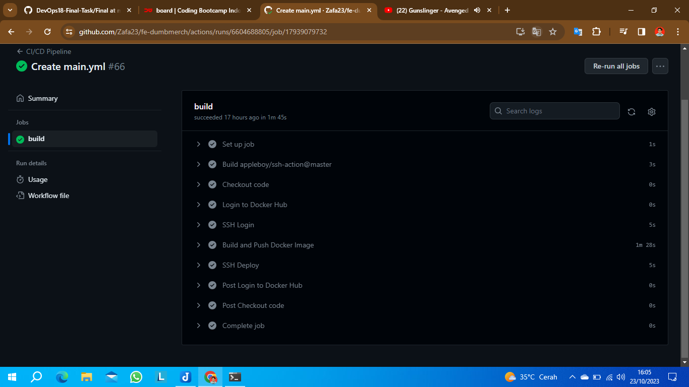

tampilan akan seperti itu sama hal nya pada backend kalian cukup ubah sediit di script saja selebihnya sama berikut script backend nya

```
name: CI/CD Pipeline

on:
  push:
    branches: [staging]
  pull_request:
    branches: [staging]
  workflow_dispatch:
  
jobs:
  build:
    runs-on: ubuntu-latest

    steps:
    - name: Checkout code
      uses: actions/checkout@v2

    - name: Login to Docker Hub
      uses: docker/login-action@v1
      with:
        username: ${{ secrets.DOCKERHUB_USERNAME }}
        password: ${{ secrets.DOCKERHUB_TOKEN }}

    - name: SSH Login
      uses: appleboy/ssh-action@master
      with:
        host: 103.175.216.224
        username: appser
        key: ${{ secrets.SSH_PRIVATE_KEY }}
        script: 'echo "Logged in to SSH"'

    - name: Build and Push Docker Image
      run: |
        docker build -t zafarassidiq/be-dumbmerch .
        docker push zafarassidiq/be-dumbmerch
        
    - name: SSH Deploy
      uses: appleboy/ssh-action@master
      with:
        host: 103.175.216.224
        username: appser
        key: ${{ secrets.SSH_PRIVATE_KEY }}
        script: |
          cd /home/appser/be-dumbmerch
          docker compose up -d
```
***