# Monitoring 
Pada saat provisioning saya sudah menyiapkan dimana saat ansible saya sudah mendeplloy jadi sekarang kita cek apakah semua sudah terpenuhi ke target 

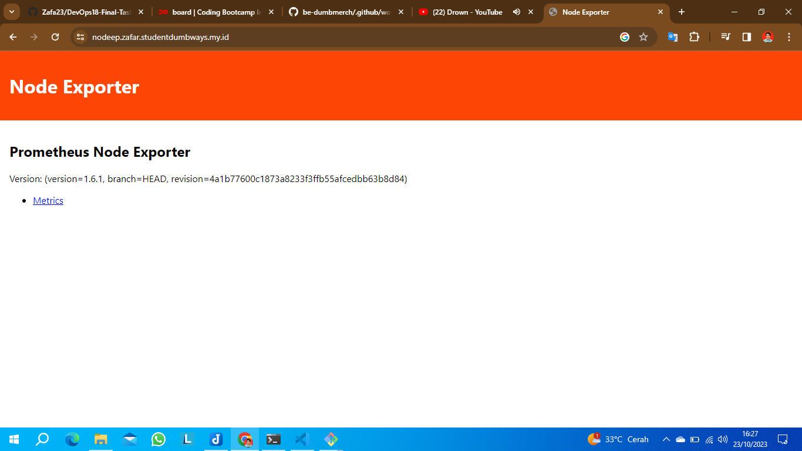

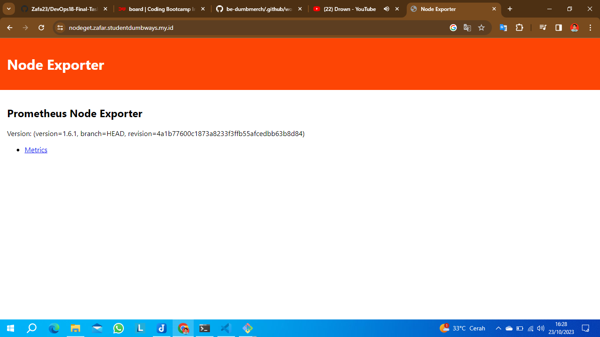

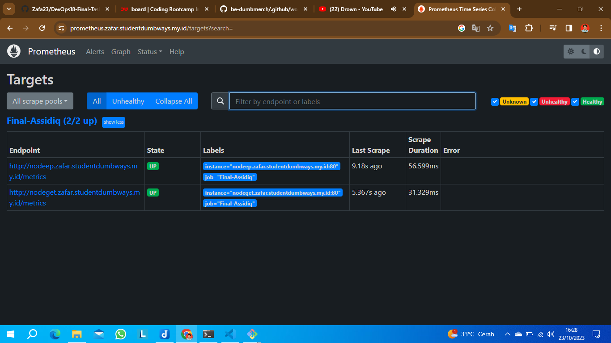
>Node : jika target masih down periksa server apakah ada exiting atau restaring pada cotainer di node exporter nya dan perhatikan jug job script pada file prometheus.yml 

```
scrape_configs:
- job_name: Final-Assidiq
  scrape_interval: 5s
  static_configs:
  - targets:
    - nodeep.zafar.studentdumbways.my.id
    - nodeget.zafar.studentdumbways.my.id
```

selanjutnya kita akan masuk ke grafan dan akan menggunakan templatte yang sudah ada dan akan setting data source juga dan akan membuat alerting berikut yang saya lakukan 
***

# Grafana 
Hal pertama yang saya lakukan adalah memasukan data source prometheus nya 
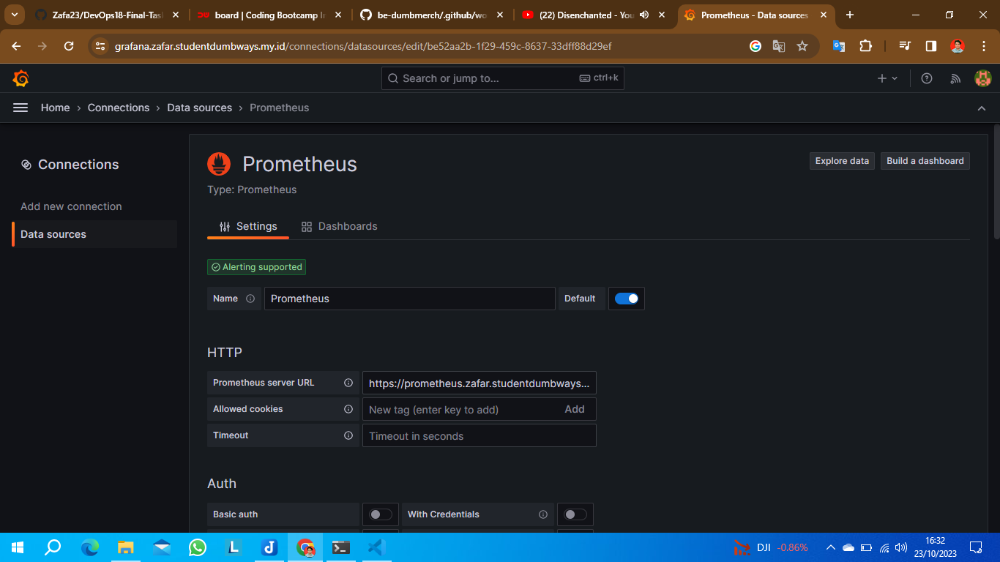

selanjutnnya save dan kita akan mengimport dashboard dengan kode 1860 

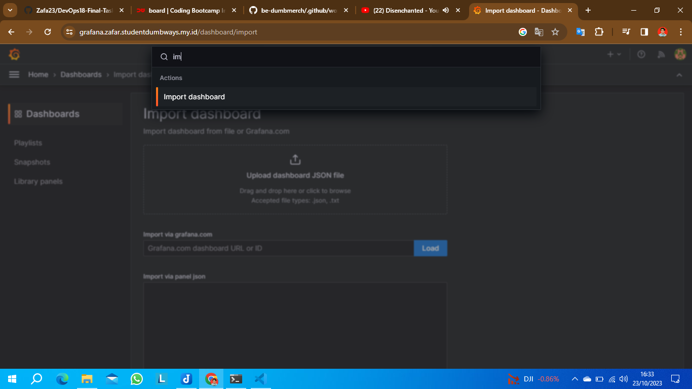

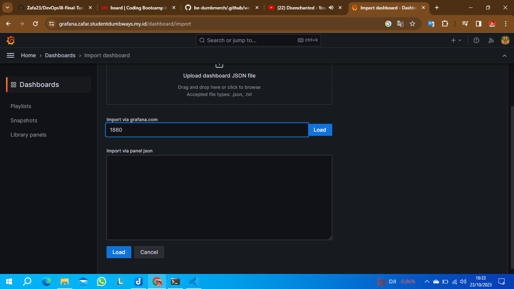
> Masukan kode yang saya temukan ini lalu  tinggal load dan save

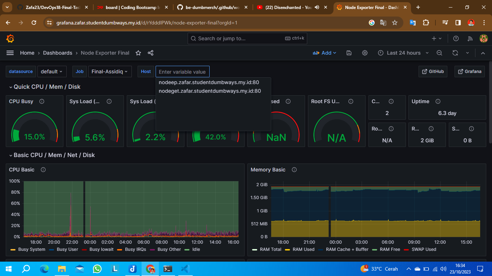
jika sudah maka tampilan akan seperti ini selanjutnya saya akan membuat alerting dimana alerting akan membantu saya ketika server saya nanti nya akan down atau butuh pembaruan maka akan di tampilkan pesan alerting di discord 
***

# Alerting
Pertama saya ke menu alerting lalu pilih bagian contact poin lalu ubah yang tadi nya email menjadi discord cara ubah nya cukup mudah 

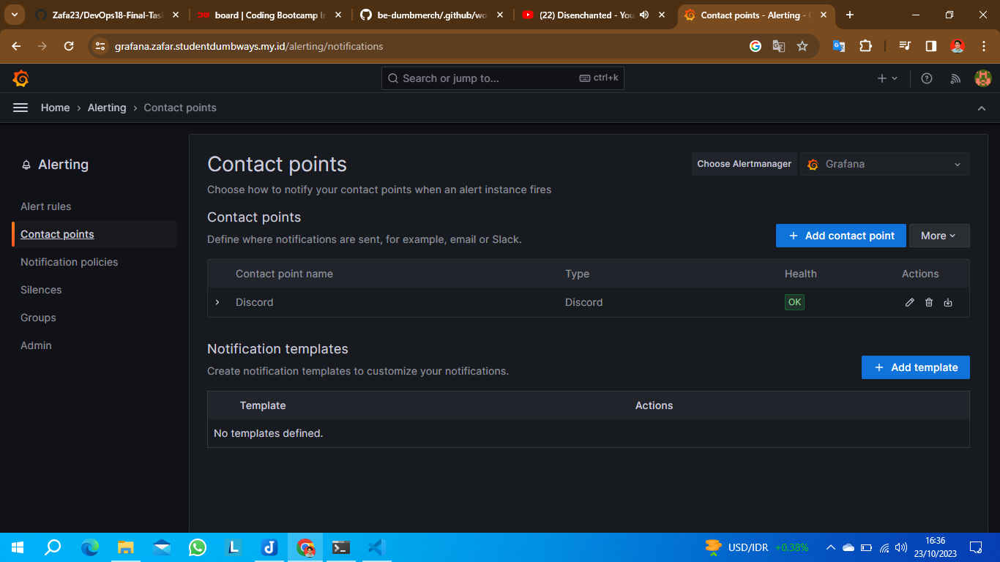
>Pada menu 	contact poin name ada gambar pensil lalu kalian pencet nanti akan tampil gambar dibawah ini

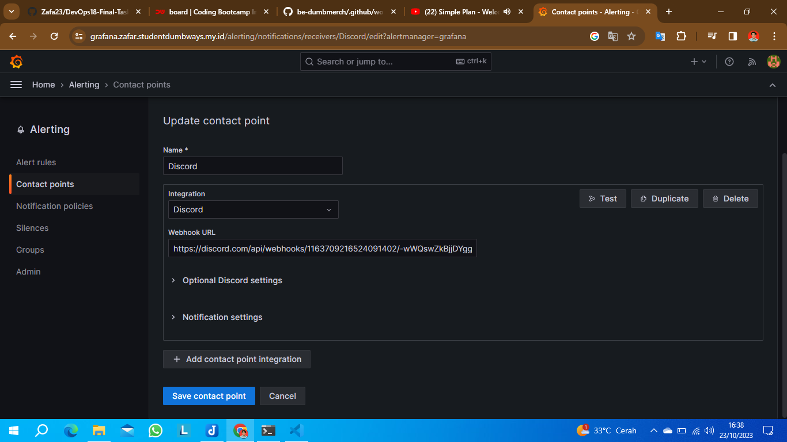
>pada bagian ini kalian tinggal ubah ke discord lalu pergi ke apk dscord lalu buat gruop atau channel baru dan ppilih menu pada gambar dibawah ini 

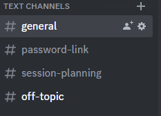
>pada menu channel berikut ada gambar setting kalian buka lalu pilih 

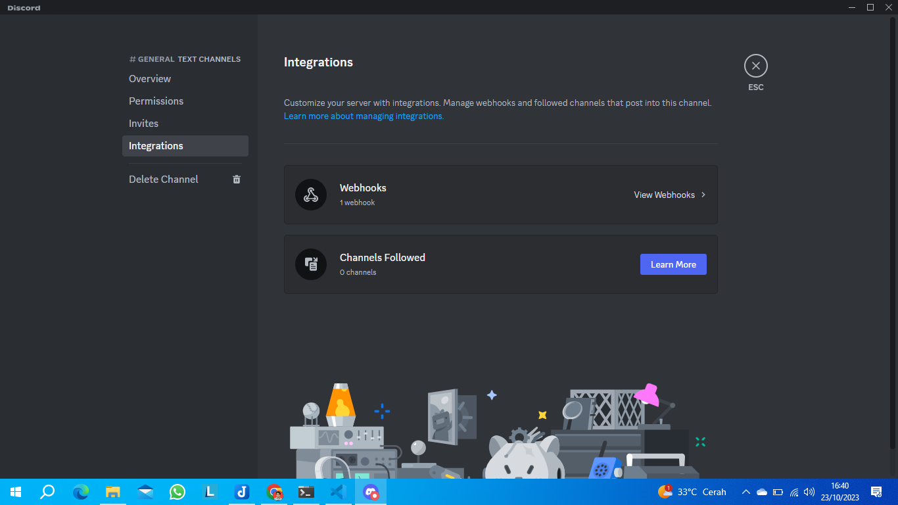
>lalu ada menu webhooks kalian buka lalu kalian tinggal buat dan salin saja jika sudah kalian tinggal coppy selanjutnya kita akan buat alert rules nya 


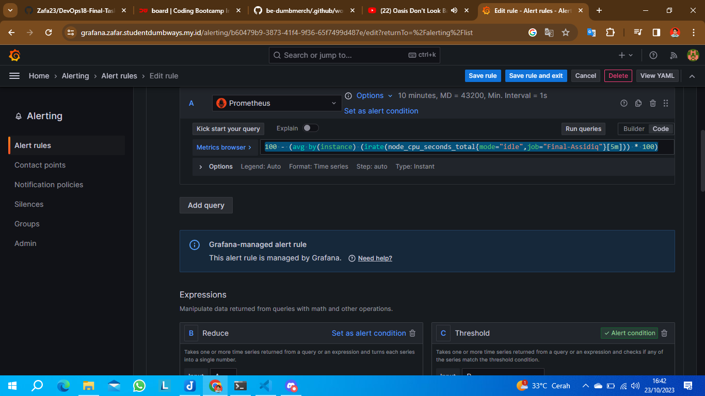
> pada menu ini kalian masukan kode di bawah ini dan setting  is above 20

```
100 - (avg by(instance) (irate(node_cpu_seconds_total{mode="idle",job="Final-Assidiq"}[5m])) * 100)
```

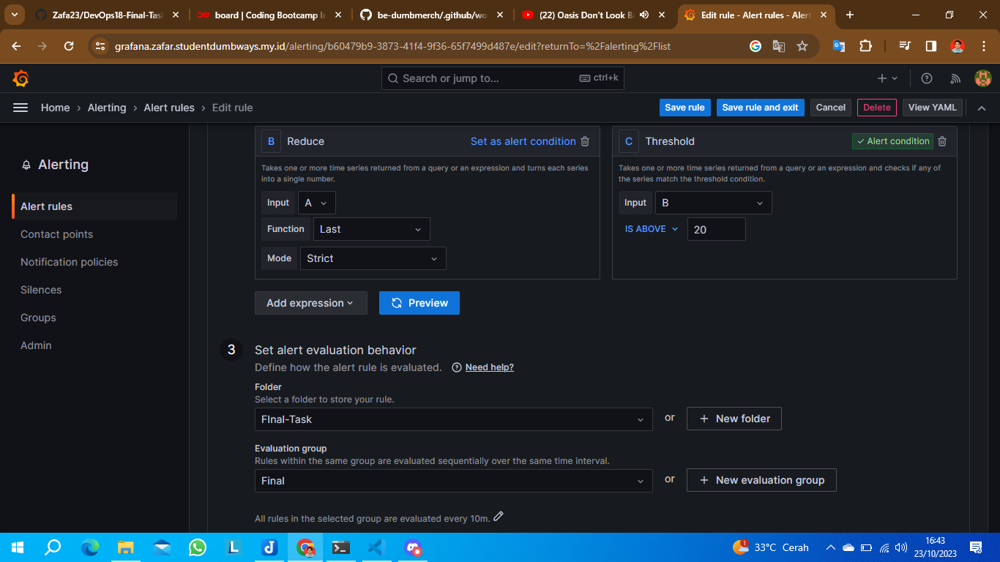
> jika sudah buat folder baru dimana bagian ini kalian akan menyimpan semua seting alert rules kalian 

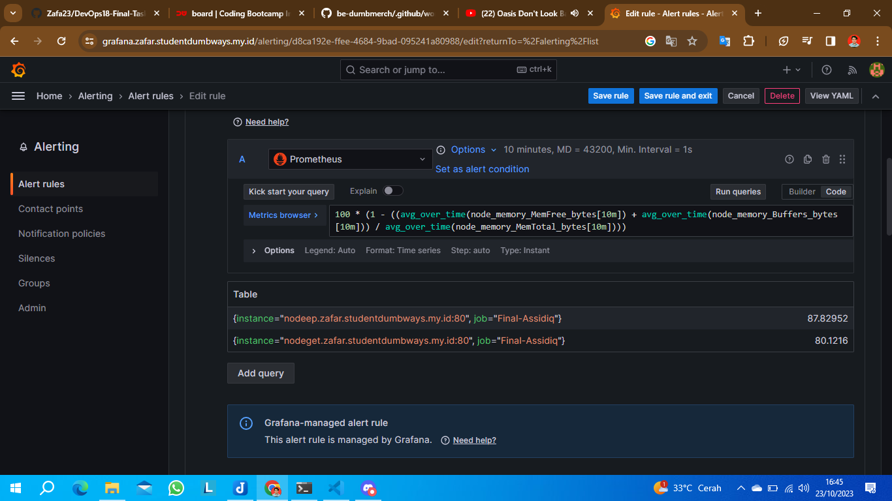
```
100 * (1 - ((avg_over_time(node_memory_MemFree_bytes[10m]) + avg_over_time(node_memory_Buffers_bytes[10m])) / avg_over_time(node_memory_MemTotal_bytes[10m])))
```

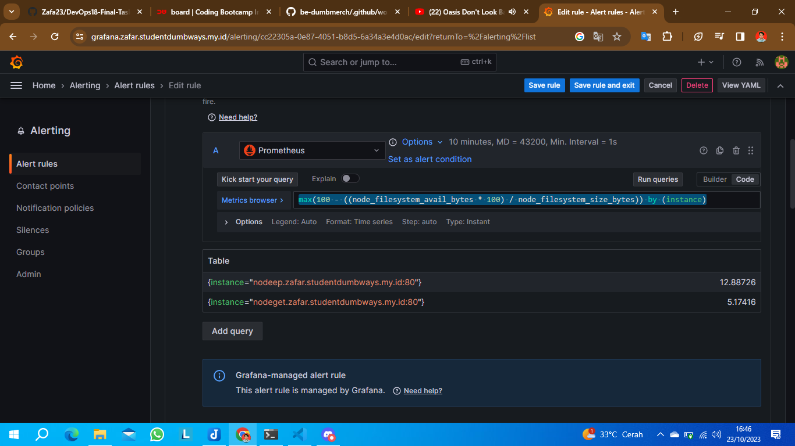

```
max(100 - ((node_filesystem_avail_bytes * 100) / node_filesystem_size_bytes)) by (instance)
```

nah itu udah sesuai urutan seperti dibawah ini urutannya 
- CPU
- RAM
- FREE STORAGE

jika semua sudah terseting maka akan muncul notif setiap server kalian sudah merasa cpu nya atau storage kalian sudah melebihi batas maka akan muncul pesan di discord sepeti ini 

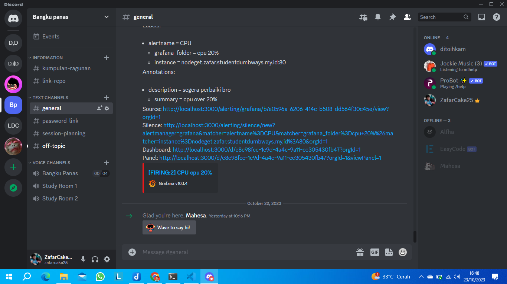

