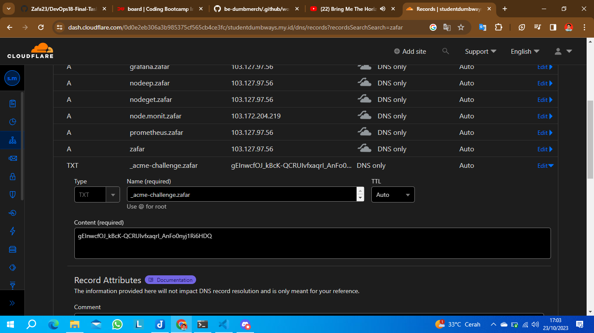

# Wildcard
Disini cukup di hapus saja certificate ssl certbot sebelumnya setelah dihapus maka kalian cukup jalanka script dibawah ini

```
- hosts: gateway
  become: yes

  tasks:
    - name: Generate and display DNS TXT record instructions
      command: sudo certbot certonly --manual -d "*.zafar.studentdumbways.my.id"
      register: certbot_output
      args:
        warn: no
      async: 3600
      poll: 0
      ignore_errors: yes
      changed_when: false

    - name: Wait for manual DNS record creation
      async_status:
        jid: "{{ certbot_output.ansible_job_id }}"
      register: job_result
      until: job_result.finished
      retries: 60
      delay: 60

    - name: Display DNS TXT record instructions
      debug:
        var: job_result.msg

  handlers:
    - name: Clean up async jobs
      async_status:
        jid: "{{ certbot_output.ansible_job_id }}"
        mode: cleanup
```

nantinya dia akan failed dan kalian cukup ambil point failed nya saja dimana ada point failed seperti ini 

```
Please deploy a DNS TXT record under the name:
_acme-challenge.zafar.studentdumbways.my.id.

with the following value:

gEInwcfOJ_kBcK-QCRUIvfxaqrI_AnFo0nyj1Ri6HDQ
```

jika sudah muncul seperti ini kalian langsung ke cloudflare 



dan kalian buat seperti diatas dan tinggal kalian jalankan ulang lagi `ansible-playbook wildcard.yml` maka sudah selesai semua deploy certificate baru nya